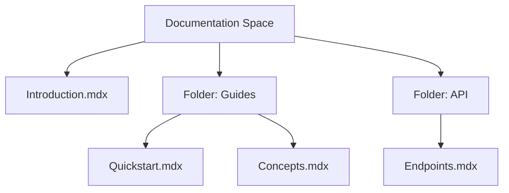

## Overview

Kreaph organizes your project documentation into structured spaces. You create a central hub called a `documentation space` where pages live in a hierarchical tree. This setup enables efficient navigation, permissions control, and seamless integration with Git repositories. Grasp these concepts to build scalable docs workflows.

<Callout kind="info">
  Kreaph uses a tree-based structure similar to file systems, with pages as nodes and spaces as roots.
</Callout>

## Core Concepts

<Columns cols={2}>
  <Card title="Documentation Spaces" icon="folder" href="#documentation-spaces">
    Root containers for all your docs pages.
  </Card>
  <Card title="Page Hierarchies" icon="layout" href="#page-hierarchies">
    Nested pages with parent-child relationships.
  </Card>
  <Card title="Permissions" icon="shield" href="#permissions">
    Granular access for teams and viewers.
  </Card>
  <Card title="Version Control" icon="git-branch" href="#version-control">
    Sync changes with Git providers.
  </Card>
</Columns>

## Documentation Space Structure

A documentation space acts as your project's doc root. You organize pages under it using folders and subpages. Changes propagate via API or Git pushes.



This structure supports unlimited nesting while keeping navigation intuitive.

## Page Types and Hierarchies

Kreaph supports standard page types like `introduction`, `quickstart`, `concepts`, `authentication`, `changelog`, and custom ones. Pages inherit hierarchy from parents, enabling sidebar navigation.

<Tabs>
  <Tab title="Standard Pages" icon="book-open">
    Use built-in types for common docs:
    
    | Type          | Purpose                          |
    |---------------|----------------------------------|
    | introduction | Landing page overview            |
    | quickstart   | First-time setup guide           |
    | concepts     | Core terminology and architecture|
    | changelog    | Release notes and updates        |
  </Tab>
  <Tab title="Custom Pages" icon="settings">
    Define your own with frontmatter:
    
````yaml
---
title: Custom Page
type: guide
---
````
    
    Nest under parents for hierarchy.
  </Tab>
</Tabs>

## Permissions and Access Levels

Control who views, edits, or admins your docs with role-based access.

| Role       | View | Edit | Admin | Description                     |
|------------|------|------|-------|---------------------------------|
| Viewer     | ✅   | ❌   | ❌    | Read-only access                |
| Editor     | ✅   | ✅   | ❌    | Edit pages and metadata         |
| Admin      | ✅   | ✅   | ✅    | Full control, including users   |

<Callout kind="tip">
  Assign roles at space or page level. Use API for programmatic changes.
</Callout>

Example API call to set permissions:

<CodeGroup tabs="cURL,JavaScript">
  ````bash
  curl -X POST https://api.example.com/v1/spaces/{spaceId}/permissions \
    -H "Authorization: Bearer YOUR_API_KEY" \
    -H "Content-Type: application/json" \
    -d '{
      "userId": "user123",
      "role": "editor"
    }'
  ````

  ```javascript
  const response = await fetch(`https://api.example.com/v1/spaces/${spaceId}/permissions`, {
    method: 'POST',
    headers: {
      'Authorization': `Bearer ${YOUR_API_KEY}`,
      'Content-Type': 'application/json'
    },
    body: JSON.stringify({
      userId: 'user123',
      role: 'editor'
    })
  });
  ```
</CodeGroup>

## Version Control Integration

Connect your space to GitHub, GitLab, or Bitbucket. Kreaph pulls changes on push, builds MDX pages, and deploys previews.

<Steps>
  <Step title="Connect Repository" icon="git-branch">
    In dashboard, select `Integrations` > `Git`.
    
    Enter repo URL: `https://github.com/your-org/kreaph-docs`.
  </Step>
  <Step title="Configure Branch" icon="git-commit">
    Set default branch (e.g., `main`) and build path (`docs/`).
  </Step>
  <Step title="Enable Webhooks" icon="zap">
    
````bash
# GitHub webhook example
webhook_url: https://api.kreaph.com/webhooks/github
events: [push, pull_request]
````
    
  </Step>
</Steps>

<Expandable title="Advanced Git Sync Options" default-open="false">
  Use `.kreaph.yml` for custom builds:
  
```yaml
build:
  command: npm run build:docs
  output: dist/
sync:
  branch: main
  ignore: ['*.tmp', 'node_modules/']
```
</Expandable>

Master these concepts to streamline your Kreaph workflows. Next, explore [Quickstart](/quickstart) for hands-on setup.