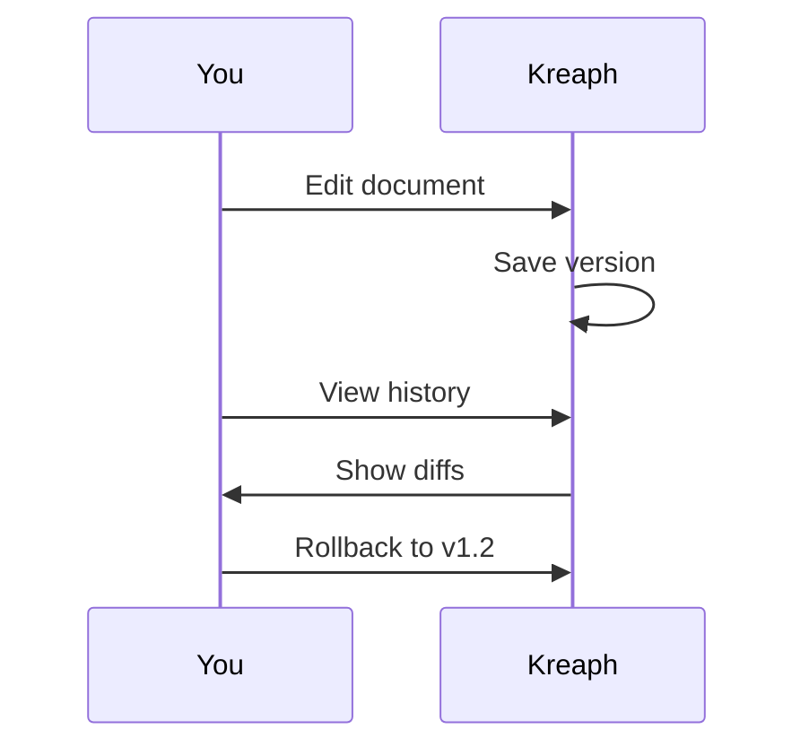

## Overview

Kreaph provides powerful tools to manage your project documentation. You organize content into spaces and folders, collaborate with teams, track versions, and share exports easily. These features streamline your workflow from creation to distribution.

<Callout kind="info">
  Start with a space to group related documents. All core features integrate seamlessly.
</Callout>

## Spaces and Folders

Organize documents hierarchically using spaces for projects and folders for subtopics.

<Steps>
  <Step title="Create a Space" icon="database">
    Navigate to the Spaces dashboard and click `New Space`.

    Enter a name like `Project Alpha` and select a brand color such as `#3B82F6`.
  </Step>
  <Step title="Add Folders" icon="folder">
    Inside the space, create folders like `API Docs` and `User Guides`.

    Drag and drop MDX files to organize content.
  </Step>
  <Step title="Nest Folders" icon="folder-plus">
    Create subfolders for deeper hierarchy, such as `API Docs > Endpoints > Users`.
  </Step>
</Steps>

This structure keeps large documentation sets navigable.

## Collaboration Tools

Kreaph supports real-time editing, comments, and permissions for teams.

<Tabs>
  <Tab title="Real-time Editing" icon="edit-3">
    Multiple users edit simultaneously. Changes appear instantly with user cursors visible.

    <Image
      src="https://via.placeholder.com/800x400/3B82F6/white?text=Real-time+Editing"
      alt="Real-time collaborative editing interface"
      width="800"
      height="400"
    />
  </Tab>
  <Tab title="Comments & Mentions" icon="message-circle">
    Add inline comments with `@username` mentions.

    Resolve threads as issues close.
  </Tab>
  <Tab title="Permissions" icon="shield">
    Set roles: Admin, Editor, Viewer.

    Control access at space or folder level.
  </Tab>
</Tabs>

<Callout kind="tip">
  Use `@all` to notify your entire team on critical updates.
</Callout>

## Version Control and History

Track changes with full history and rollback capabilities.

Every edit creates a version. View diffs and restore previous states.



<CodeGroup tabs="CLI,API">
  ```bash
  kreaph version list --space=project-alpha
  kreaph version restore --id=abc123
  ```
  ```javascript
  const kreaph = require('kreaph-sdk');
  const versions = await kreaph.versions.list({ spaceId: 'project-alpha' });
  await kreaph.versions.restore('abc123');
  ```
</CodeGroup>

## Export and Sharing Options

Share documentation via multiple formats.

<Columns cols={2}>
  <Card title="PDF Export" icon="file-text" href="#">
    Generate printable PDFs with custom branding.
  </Card>
  <Card title="HTML Site" icon="globe" href="#">
    Publish as a static site to `https://docs.yourproject.com`.
  </Card>
  <Card title="Markdown ZIP" icon="package" href="#">
    Download all content as raw MDX files.
  </Card>
  <Card title="Public Links" icon="share-2" href="#">
    Share read-only links with expiration dates.
  </Card>
</Columns>

<Expandable title="Advanced Export Settings" default-open="false">
  Customize exports with themes, watermarks, and password protection.

  Use the API for automation:

  ```javascript
  await kreaph.exports.create({
    spaceId: 'project-alpha',
    format: 'pdf',
    options: { brandColor: '#3B82F6' }
  });
  ```
</Expandable>

## Next Steps

Integrate these features into your workflow.

<Card title="Quickstart" icon="rocket" href="/quickstart">
  Set up your first space in minutes.
</Card>

<Card title="Authentication" icon="key" href="/authentication">
  Secure team access properly.
</Card>